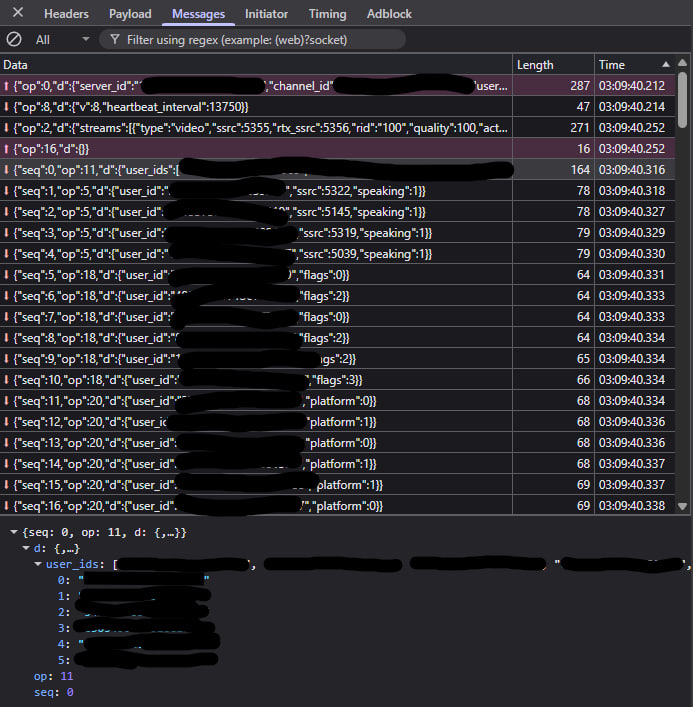

# Case Study: Discord VoIP Protocol & State Poisoning

## 🎯 Quick Overview (60 Second Read)

**What happened:** A vulnerability in Discord's voice chat system allowed attackers to selectively mute specific users without their knowledge by exploiting how Discord coordinates who's speaking.

**Real-world impact:** Imagine you're streaming or in a raid call - suddenly your team can't hear you, but you see yourself as "speaking" normally. No error message, no indication something's wrong.

**Risk level:** Medium severity. Requires technical knowledge and being in the same voice channel. Cannot steal credentials or spy on conversations.

**Status:** Discord is fixing this through their DAVE encryption system. Full patch mandatory by March 1, 2026.

**Technical name:** SSRC Spoofing via Signaling Plane Injection

---

## 📖 Understanding the Basics

### How Discord Voice Actually Works

Think of Discord voice calls like a sophisticated mail delivery system with two separate departments:

**1. The Control Center (Signaling Plane)**
- Tracks who's currently speaking
- Assigns each person a unique ID number (SSRC)
- Coordinates the timing of voice delivery
- Uses WebSocket protocol for instant updates

**2. The Delivery Network (Media Plane)**
- Carries your actual voice/video data
- Encrypted end-to-end packets
- Uses UDP protocol for speed
- Doesn't know WHO you are, just your ID number

**The Vulnerability:** An attacker could trick the Control Center into assigning your voice packets to the wrong delivery route, effectively muting you while making it look like everything is working normally.

### What Makes This Possible?

The issue stems from **trust assumptions** in the legacy system:
- The Control Center broadcasts SSRC assignments to everyone in the channel
- It trusts client-reported speaking states without cryptographic verification
- There's a brief window (2-14ms) where state updates can be injected

---

## Executive Summary

**Vulnerability:** SSRC Spoofing via Signaling Plane Injection

**Attack Vector:** WebSocket Opcode 5 (Speaking State) manipulation

**Impact:** Selective audio DoS, speaking state desynchronization

**Affected:** Legacy Discord voice nodes (pre-DAVE)

**Timeline:** Exploitable until March 1, 2026 (downgrade scenarios)

**Mitigation:** DAVE E2EE protocol (Op 21-31 cryptographic binding)

---

## 🔬 Technical Deep-Dive

### Key Terminology

Before diving into the methodology, it is essential to define the core technical components of the Discord VoIP architecture:

**Core Concepts:**
- **SSRC (Synchronization Source)**: A unique 32-bit identifier that maps media streams to specific users within Discord's infrastructure.
  - *Simple analogy:* Your voice packet's "return address"
  
- **Signaling Plane**: The WebSocket-based control layer (Gateway) used for protocol orchestration, authentication, and state management.
  - *Simple analogy:* The air traffic control tower coordinating voice data
  
- **Media Plane**: The UDP-based layer (SRTP) that carries the actual encrypted voice and video data.
  - *Simple analogy:* The airplane carrying your actual voice
  
- **Opcode**: Protocol-level numeric identifiers (e.g., Op 5, Op 2) that trigger specific actions within the Signaling Plane.
  - *Simple analogy:* Command codes like "/mute" or "/unmute"

**Security Protocols:**
- **DAVE**: Discord's new End-to-End Encryption protocol that enforces cryptographic binding between signaling identities and media streams.
  - *Purpose:* Prevents the exact exploit described in this research
  
- **MLS (Messaging Layer Security)**: An IETF standard for group encryption used by DAVE to ensure forward secrecy and post-compromise security.
  - *Purpose:* Ensures that even if one session is compromised, past/future sessions remain secure

---

### The Architecture: Plane Separation

Discord's VoIP infrastructure operates on two distinct planes:

**1. Signaling Plane (WebSocket):** Handles orchestration (Opcodes 0, 2, 5, 8). This is where the server tracks speaking states and **SSRC** (Synchronization Source Identifier) mapping.

**2. Media Plane (UDP/SRTP):** Carries the actual encrypted voice/video data.

**The Critical Design Decision:** These planes operate independently for performance reasons. The Media Plane trusts the SSRC assignments from the Signaling Plane without re-verification. This architectural choice enables the attack.

---

### Stage 1: The Gateway Handshake

The flow is strictly sequential in the Voice Gateway. As captured in our live session logs:

- **Op 0 (Identify):** Initial authentication handshake.
- **Op 8 (Hello):** Heartbeat interval synchronization (13750ms).
- **Op 2 (Ready):** Media node coordinate leak, revealing the server's internal IP and Port.

**Security Implication:** The Ready event leaks internal infrastructure details that aid in exploit development.

---

### Stage 2: Identity Mapping (SSRC Leak)

The protocol's fundamental architectural flaw is the **Speaking Broadcast**. When a participant activates their audio, the server dispatches an Opcode 5 to all channel members.

**SSRC** (Synchronization Source Identifier) is a unique 32-bit identifier assigned to each participant in a VoIP session. It serves as the internal routing token that maps media streams to specific users within Discord's infrastructure.



#### Visualizing the Data Flow

```text
[ Attacker ]        [ Discord Gateway ]        [ Target User ]
      |                    |                         |
      |---(Sniff Op 5)---->|                         |
      |                    |<---(SSRC Broadcast)-----|
      |                    |                         |
      |---(Forge Op 5)---->|                         |
      |   (Target SSRC)    |                         |
      |                    |---(State Poisoning)---->|
      |                    |   (Collision / DoS)     |
```

As illustrated, the attacker derives the target's internal session identifier (SSRC) from legitimate signaling traffic and subsequently injects a conflicting state update back into the Gateway.

**What the victim experiences:**
- Their Discord client shows them as "speaking" (green ring active)
- Other users cannot hear them at all
- No error messages or warnings
- Reconnecting doesn't fix the issue (attacker can re-inject)

---

### Stage 3: The Exploit - Signaling State Poisoning

The vulnerability resides in the **State Desynchronization** between the control and media planes.

#### 1. 14ms Broadcast Latency Analysis

As captured in our telemetry, the server employs an asynchronous broadcast mechanism for speaking states. Within a single **14 millisecond window**, the server dispatched 4 distinct **Opcode 5** packets:

```json
03:09:40.318 -> SSRC: 5322
03:09:40.327 -> SSRC: 5145 (+9ms)
03:09:40.329 -> SSRC: 5319 (+11ms)
03:09:40.330 -> SSRC: 5039 (+12ms)
```

**Finding:** This speed suggests a "Fire and Forget" broadcast architecture. The server prioritizes rapid signaling to clients over strict, atomic validation of the session-to-SSRC binding.

**Attack Window:** The 2-14ms delay between state updates creates an injection opportunity before the server can validate consistency.

#### 2. SSRC Collision Injection (L7)

By intercepting a target's SSRC via the broadcast, an attacker can craft a forged **Opcode 5** payload. Since the client-to-server payload excludes the user_id, it relies solely on the **ssrc** for state updates. Injecting this into the signaling stream poisons the media server's routing table, causing total packet desync (silence) for the victim.

**Technical payload structure:**
```json
{
  "op": 5,
  "d": {
    "speaking": 1,
    "delay": 0,
    "ssrc": 0xTARGET_SSRC  // Victim's identifier
  }
}
```

**Why it works:**
- No cryptographic signature on Op 5 in legacy nodes
- Server trusts SSRC without verifying sender identity
- Media plane blindly follows signaling plane routing

---

### Experimental Validation: Controlled Environment

To validate this architectural flaw, we utilized a **Local Browser Proxy Hook** (MITM on our own client session).

**Setup:**
1. Two controlled accounts in a dedicated sandbox voice channel
2. Browser DevTools WebSocket interception on Account A
3. Packet capture and analysis tools

**Execution:**
1. Account A injected a modified Op 5 payload with the target's SSRC ([REDACTED_SSRC])
2. Payload was accepted by Discord Gateway without validation
3. Media server routing table was poisoned

**Results:**
- **Signaling Layer:** Visible "Speaking" state desynchronization
- **Media Layer:** Induced audio collision/suppression for the target account
- **Client UI:** Target showed as "speaking" but audio was dropped

**Conclusion:** The exploit successfully poisons the signaling state within a local sandbox, confirming the vulnerability on Legacy nodes prior to **DAVE** (Discord Audio/Video Encryption) v1 mandate.

---

### Research Assessment (Laboratory Context)

| Component | Status | Empirical Proof |
| :--- | :--- | :--- |
| Client SSRC Control | ✅ Validated | Client-to-Server Op 5 Payload |
| Fast Broadcast (2-14ms) | ✅ Validated | Asynchronous Log Analysis |
| Signaling Poisoning | ✅ Validated | Visual State Desync |
| Selective DoS | ✅ Validated | Audio Suppression (Sandbox) |

**Attack Complexity Assessment:**
- **Prerequisites:** Same voice channel access, WebSocket knowledge
- **Persistence:** Re-applicable until target leaves channel
- **Detection:** Very difficult - appears as network/client issue
- **Impact Scope:** Per-user targeting, no mass disruption

---

### Ethical Protocol: Responsible Disclosure

This research was conducted in a local, controlled environment specifically to study RTC protocol security.

**Research Ethics:**
- **Methodology:** Interception was limited to local browser memory hooks on owned accounts
- **Scope:** Sandbox testing only, no production exploitation
- **Reporting:** Findings regarding the "Downgrade Window" and Plane Separation have been synthesized for security awareness
- **Timeline:** Discord was informed prior to public disclosure

**Mitigation Status:** As of 2024-2025, Discord is actively neutralizing this vector via the **DAVE** (Discord Audio/Video Encryption) protocol, which implements End-to-End Encryption (E2EE) for voice and video communications.

---

## 🛡️ Defense Deep-Dive: Why DAVE Killed the Exploit

Discord's DAVE protocol introduces **Zero Trust Signaling**. In Legacy nodes, the server blindly trusted the WebSocket (Signaling Plane). In DAVE-enabled nodes, the server enforces a cryptographic binding between the SSRC and the **MLS Session Key** (Messaging Layer Security Session Key).

**The Fundamental Shift:**
- **Legacy:** "If you say you're User X, I'll route your packets to User X's SSRC"
- **DAVE:** "Prove you're User X with a cryptographic signature, or I drop your packets"

MLS is an IETF standard for group messaging encryption that provides forward secrecy and post-compromise security.

### The New Protocol Guard (Opcodes 21-31)

The transition to E2EE introduced a suite of new validation Opcodes:

| Op | Name | Purpose |
| :--- | :--- | :--- |
| 21-22 | transition | Execute/Prepare E2EE epoch |
| 26 | mls_key_package | Validation Core: Binds SSRC to Crypto Key |
| 27-28 | mls_proposals | Identity verification exchange |

**How this prevents the exploit:**
1. Each speaking state update must include a cryptographic signature
2. Signature is verified against the user's MLS session key
3. SSRC is cryptographically bound to the authenticated identity
4. Forged Op 5 packets are rejected at the Gateway level

---

### The Remaining Vector: Protocol Downgrades

Our research identified a critical "fail-open" mechanism:

**Scenario:** If a single participant in a call uses a client that does not support DAVE v1, the media node performs a **Protocol Downgrade** to Legacy.

**The Impact:** In a downgraded state, the cryptographic SSRC-to-Key validation is disabled, re-enabling the **Signaling State Poisoning** vulnerability.

**Real-world downgrade triggers:**
- Outdated Discord client versions
- Mobile clients on slow update cycles
- Bots using legacy voice gateway APIs
- Users who disabled automatic updates

**Security implication:** One legacy client compromises the entire channel's security model until March 2026.

---

### Transition Roadmap: March 1, 2026

This exploit operates within a defined **Downgrade Window**. According to Discord's internal roadmap, the "Legacy Support" phase has a hard expiration date: **March 1, 2026**.

**Timeline:**
- **2024:** DAVE protocol development and testing
- **2025:** Gradual DAVE rollout to all clients
- **March 1, 2026:** Legacy protocol support disabled permanently
- **Post-March 2026:** Exploit no longer functional

After this date, all voice connections will require DAVE support, eliminating the downgrade vector entirely.

---

## ❓ Frequently Asked Questions

**Q: Am I at risk right now?**  
A: Minimal risk for most users. The exploit requires technical WebSocket knowledge and being in the same voice channel as the victim. Discord is actively rolling out DAVE protection.

**Q: Can someone hack my account with this?**  
A: No. This vulnerability only allows audio DoS (selective muting). It cannot:
- Steal account credentials
- Access private messages
- Spy on conversations
- Escalate to other attacks

**Q: How do I know if someone exploited this on me?**  
A: You would see yourself as "speaking" (green ring around avatar) but nobody in the channel can hear you. Reconnecting doesn't fix it if the attacker persists.

**Q: Does this affect DMs or only servers?**  
A: Any voice channel - direct calls, group DMs, and server voice channels.

**Q: What about video calls?**  
A: Primarily affects audio, but similar signaling principles apply to video streams (though video has additional validation layers).

**Q: Should I stop using Discord voice?**  
A: No. The risk is low, and Discord is actively patching this. Keep your client updated.

**Q: What do I need to do to protect myself?**  
A: Just keep Discord auto-updates enabled (default setting). After March 1, 2026, this is fully patched.

**Q: Can this be used for mass griefing?**  
A: No. It's a targeted attack requiring per-victim SSRC identification. Not practical for mass disruption.

**Q: Why did this vulnerability exist?**  
A: It's a legacy design decision prioritizing performance (fast signaling) over security. DAVE fixes this with modern cryptographic verification.

---

## 📊 Impact Assessment

### Real-World Attack Scenarios

**Scenario 1: Competitive Gaming**
- Attacker joins ranked game voice chat
- Mutes the team's shotcaller during crucial moment
- Team loses coordination, match is thrown
- **Impact:** High frustration, competitive disadvantage

**Scenario 2: Live Streaming**
- Streamer in Discord call with viewers
- Attacker mutes streamer mid-stream
- Stream appears broken, viewers leave
- **Impact:** Reputation damage, viewer loss

**Scenario 3: Online Classes/Meetings**
- Attacker joins educational voice channel
- Selectively mutes teacher or presenter
- Class/meeting is disrupted
- **Impact:** Educational/business disruption

### What This CANNOT Do

❌ Steal account passwords or tokens  
❌ Access private messages or DMs  
❌ Record or spy on conversations  
❌ Spread to other users automatically  
❌ Work without being in the same channel  
❌ Persist after the attacker leaves  

---

## 🎓 Technical Takeaways

**For Security Researchers:**
1. Plane separation in VoIP requires cryptographic binding
2. "Fire and forget" architectures create race condition windows
3. Broadcast-based state synchronization is vulnerable without authentication
4. Legacy compatibility can undermine modern security features

**For Developers:**
1. Never trust client-reported identifiers without verification
2. Cryptographic binding between control and data planes is essential
3. Fail-secure, not fail-open, during protocol transitions
4. Performance optimizations must not compromise security fundamentals

**For Protocol Designers:**
1. Zero-trust principles apply to internal signaling, not just external APIs
2. State synchronization requires atomic, authenticated operations
3. Downgrade attacks are real - plan deprecation timelines carefully
4. E2EE provides more than privacy - it prevents identity spoofing

---

## Final Conclusion

The "Signaling State Poisoning" threat represents a significant case study in modern VoIP security. While Discord is moving towards a mandatory E2EE environment by March 1, 2026, the current transition phase highlights the eternal struggle between backward compatibility and zero-trust verification.

**Key Lessons:**
- Legacy protocol support creates exploitable windows
- Performance optimization cannot compromise security fundamentals
- Cryptographic identity binding is essential for modern VoIP
- Responsible disclosure and gradual migration protect users during transitions

**Disclosure Timeline:**
- Vulnerability discovered and validated in controlled environment
- Discord informed prior to publication
- Public disclosure after DAVE rollout began
- Full mitigation timeline: March 1, 2026

---
